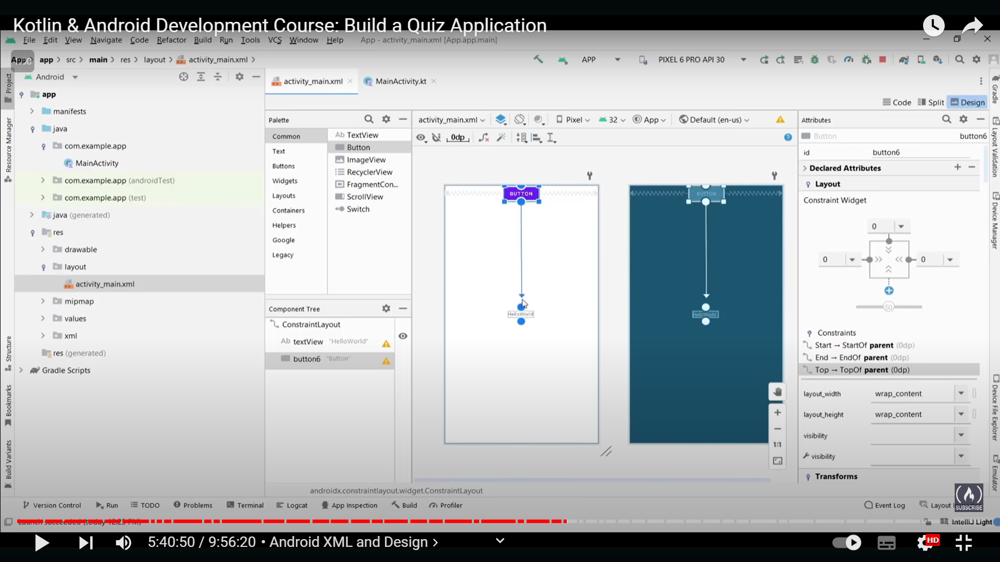
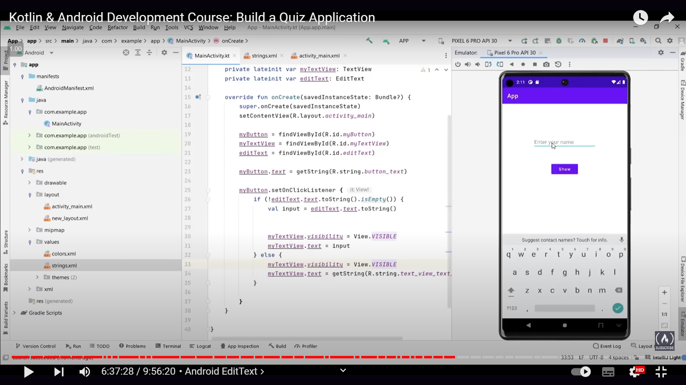
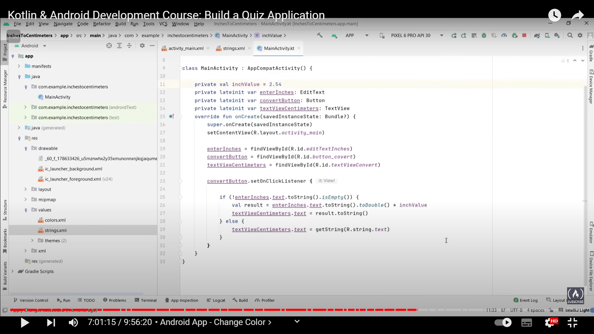
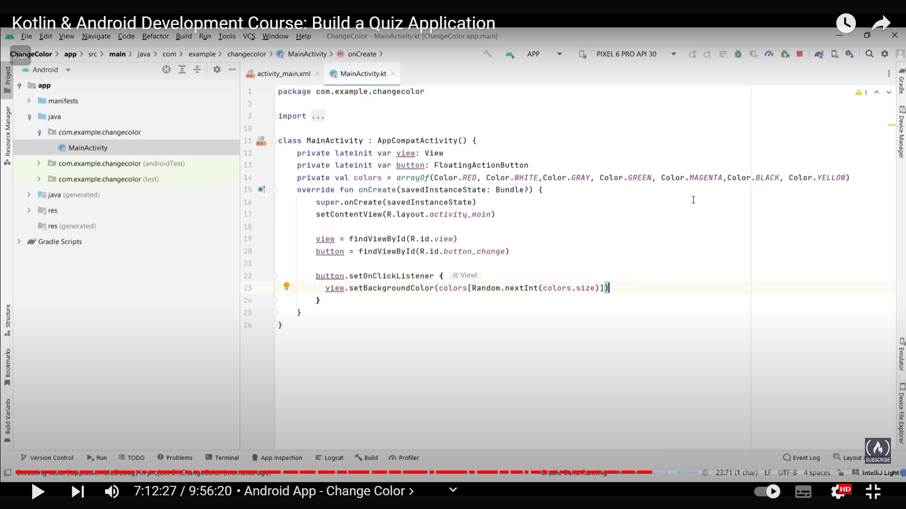
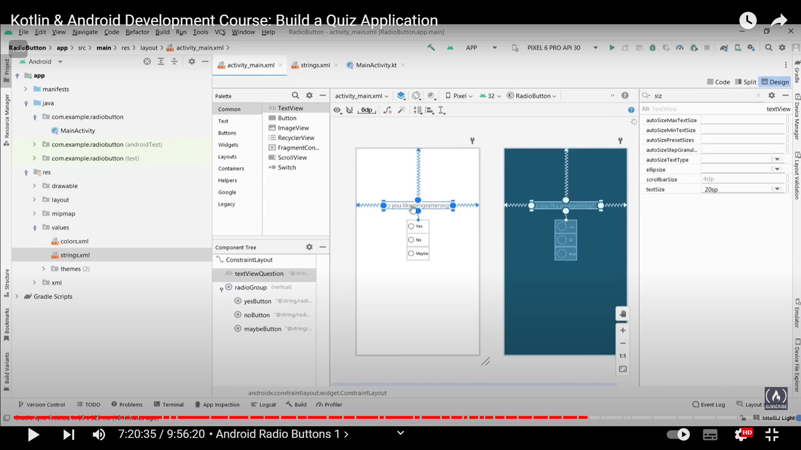
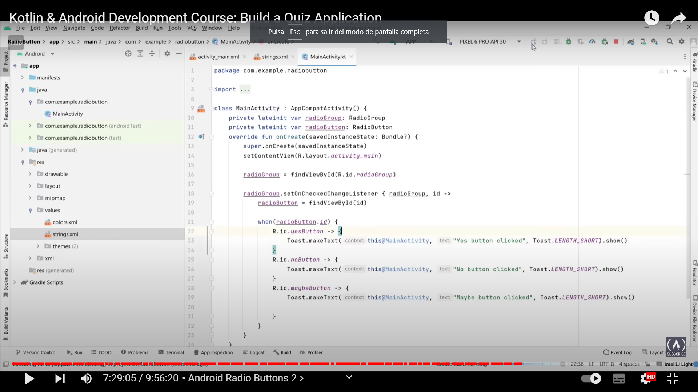
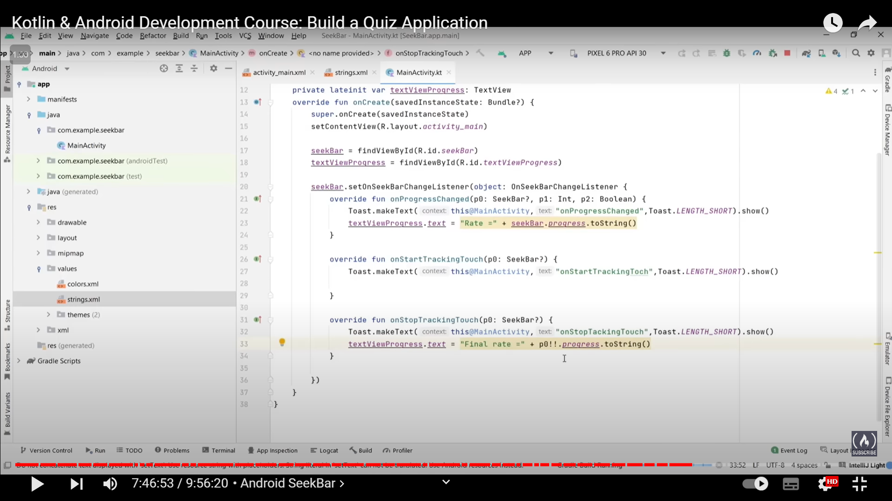
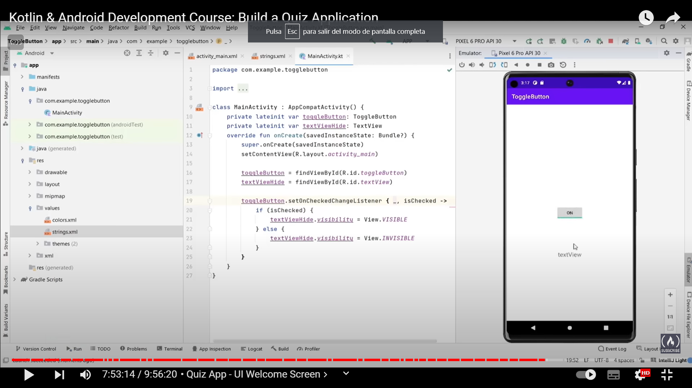

# quiz-app
Kotlin freecodecamp course on building a quiz application

Course:
https://www.youtube.com/watch?v=kNghEbknLs8&ab_channel=freeCodeCamp.org

# List, Set, Map

Collections: group of objects in a single variable.

Mutable: you can write to that collection. You can add and remove elements from that collection.

Inmutable: you can only add elements when you instantiate the collection.

```kotlin
val names = ListOf<String>("Name 1", "Name 2", "Name 3") //inmutable list
println(names[0])

val names = mutableListOf("Name 1", "Name 2", "Name 3") //mutable list
names.add("Name 4")
names.removeAt(0)
names.removeAt("Name 2")
names.forEach { println(it) }
```

Set: collection which can only store unique elements, it cannot have duplicates.

```kotlin
val names = mutableSetOf<String>("Name 1", "Name 2", "Name 1") //mutable set
names.add("Name 3")
names.forEach { println(it) }
```

Map collection is used to store key-value pairs.

```kotlin
val users = mapOf<Int, String>(1 to "Name 1", 2 to "Name 2", 3 to "Name 3") //inmutable map
println(users[1])

val users = mutableMapOf<Int, String>(1 to "Name 1", 2 to "Name 2", 3 to "Name 3") //mutable map
users[5] = "Name 5"
user.remove(2)
users.forEach { t, u -> println("$t and $u") }
```

# Collections operations

Transformations: functions with you can change an specific collection.

```kotlin
val numbers = setOf(1,2,3,4)
println(numbers.map{it*10}) //multiply every item by 10

val numbersMap = mapOf("key 1" to 1, "key 2" to 2, "key 3" to 3)
println(numbersMap.mapKeys { it.key.uppercase() })
println(numbersMap.mapValues { it.value + it.key.length })
```

Zipping: create pairs of elements with the same position in both collections

```kotlin
val colors = listOf("red", "brown", "grey")
val animals = lisOf("fox", "bear", "wolf")
println(colors.zip(animals)) //result: [(red, fox), (brown, bear), (grey, wolf)]
//another form is by typing: colors zip animals
println(colors.zip(animals){ color, animal -> "The ${animal.replaceFirstChar { it.uppercase() }} is $color" })
```

Unzip:

```kotlin
val numberPairs = listOf("one" to 1, "two" to 2, "three" to 3)
println(numberPairs.unzip())
```

Association: build maps from the collection element and insert values associated with them.

```kotlin
val numbers = listOf("one", "two", "three")
println(numbers.associatedWith { it.length }) //result: {one=3, two=3, three=5}
println(numbers.associateBy { it.first().uppercase() }) //creates a key with the first letter of each element
//result: {O=one, T=three, F=four}
println(numbers.associateBy(keySelector = {it.first().uppercase()}, valuTransform = {it.length}))
//result: {O=3, T=5, F=4}, it transforms both keys and values.
```

associatedWith creates values and associateBy creates keys.

Flatten: convert a two dimensional array into a one dimensional array.

```kotlin
val numbersSets = ListOf(setOf(1,2,3), setOf(4,5,6), setOf(7,8,9))
val numbersFlatten = numbersSets.flatten()
```

# String representation

```kotlin
val numbersStrings = listOf("one", "two", "three")
val listString = StringBuffer("The list of numbers: ")
println(numbersString.joinTo(listString))
//result: The list of numbers: one, two, three
println(numbersString.joinToString(separator = " | ", prefix = "start: ", postfix = ": end"))

val numbers = (1..100).toList()
println(numbers.joinToString(limit = 5, truncated = "<...>"))
// result: 1, 2, 3, 4, 5, <...>

println(numbersString.joinToString { "Element: ${it.uppercase()}" })
//result: Element: ONE, Element: TWO, Element: TRHEE
```

# Filtering

filter retrieves the elements that match with a predicate.

```kotlin
val numbers = listOf("one", "two", "three")
val longerThan3 = numbers.filter { it.length > 3 }
println(longerThan3)
//result: three

val numbersMap = mapOf("key 1" to 1, "key 2" to 2, "key 3" to 3, "key 101" to 101)
val filteredMap = numbersMap.filter { it.key.endsWith("1") && it.value > 100 }
println(filteredMap)
//result: {key 101=101}

val filteredIndex = numbers.filterIndexed {index, value -> (index != 0) && (value.length < 5)}
val filteredNot = numbers.filterNot { it.length <= 3 }
println(filteredIndex)
//result: [two]
println(filteredNot)
//result: [three]

val mixedList = listOf(1,2,3,'A','B','C',"Hello world", false)
mixedList.filterIsInstance<Char>().forEach { println(it) } //filter by type
//result: A B C

//partition: keeps the elements that not match in a separate list
val (match, rest) = numbers.partition { it.length > 3 }
println(match)
//result: [three]
println(rest)
//result: [one, two]
```

# Test preifactes:

any(): returns true if one element matches the predicate

none(): returns true if all the elements does not match the predicate

all(): returns true if all the elements match the predicate

# Plus and minus operators

```kotlin
val numbers = mutableListOf("one", "two", "three")
val plusList = numbers + "four"
val minusList = numbers - mutableListOf("three", "two")
println(plusList)
// result: [one, two, three, four]
println(minusList)
//result: [one]
```

# Grouping

```kotlin
val numbers = listOf("one", "two", "three", "four", "five")
println(numbers.groupBy { it.first().uppercase() })
//result: {O=[one], T=[two, three], F=[four, five]}
println(numbers.groupBy(keySelector = {it.first()}, valueTransform = {it.uppercase()} ))
//result: {O=[ONE], T=[TWO, THREE], F=[FOUR, FIVE]}
```

# Retrieve Collections parts

```kotlin
val numbers = listOf("one", "two", "three", "four", "five", "six")
println(numbers.slice(1..3))
//result: [two, three, four]
println(numbers.slice(1..4 step 2))
//result: [one, three, five]
println(numbers.slice(setOf(3,5,0)))
//result: [four, six, one]

println(numbers.take(3))
//result: [one, two, three]
println(numbers.takeLast(3))
//result: [four, five, six]
println(numbers.drop(1))
//result: [two, three, four, five, six]
println(numbers.dropLast(5))
//result: [one]

println(numbers.takeWhile { !it.startsWith("f") }) //take elements until one element start with "f"
//result: [one, two, three]
println(numbers.takeLastWhile { !it != "three" })
//result: [four, five, six]
println(numbers.dropWhile { it.length == 3 })
//result: [three, four, five, six]
println(numbers.dropLastWhile { !it.contains("i") })
//result: [one, two, three, four]

val numbersInt = (0..13).toList()
println(numbersInt.chunked(3))
//result: [[0, 1, 2], [3, 4, 5], [6, 7, 8], [9, 10, 11], [12, 13]]
println(numbersInt.chunked(3, { it.sum() }))
//result: [3, 12, 21, 30, 25]

val numbersString2 = numbers
println(numbersString2.windowed(3))
//result: [[one, two, three], [two, three, four], [three, four, five], [four, five, six]]
```

# Retrieve single elements

```kotlin
val numbers = listOf("one", "two", "three", "four", "five")
println(numbers.elementAt(3))
//result: four
println(numbers.first())
//result: one
println(numbers.last())
//result: five
println(numbers.first{ it.length > 3 }) //retrieve first element with greater length than 3
//result: three
println(numbers.first{ it.startsWith("f")})
//result: five
println(numbers.random())
//result: RANDOM-ELEMENT
println(numbers.isEmpty())
//result: false
```

# Aggregate operations

```kotlin
val numbers = listOf(6,10,14,4,100)
println("The sum is ${numbers.sum()}")
println("The count is ${numbers.count()}")
println("The average is ${numbers.average()}")
println("The max value is ${numbers.maxOrNull()}")
println("The mean is ${numbers.meanOrNull()}")
println("The sum is ${numbers.sumOf { it * 2 } }") //multiplies the sum by 2
```

# Comparable and comparator

```kotlin
data class Laptop(val brand: String, val year: Int, val ram: Int, val price: Int)

val numbers = mutableListOf(2,5,1,40,20,100,60)
numbers.sorted().forEach { println(it) } //numbers sorted ascending
//It works because the Int class implements the compareTo function

//Comparator allows you to order by several fields
//you can do that by inheriting the Comparator in your comparator class and overriding the compare function
//for example if the comparator class is called ComparatorRam:
laptops.sortedWith(ComparatorRam().forEach { println(it) })

//Another option is using lambda functions
laptops.sortedWith(compareBy { it.price }).forEach { println(it) }
laptops.sortedWith(compareBy { it.ram }).forEach { println(it) }
laptops.sortBy { it.price }.forEach { println(it) } //shorter form than the previous one
laptops.sortBy { it.ram }.forEach { println(it) }
laptops.sortedWith(compareBy<Laptop> {it.year}. thenBy {it.price}).forEach { println(it) }
```

# Binary search

Binary search is a search algorithm used to find the position of a specific value within a sorted array or list. It works by repeatedly dividing the search interval in half. Here's how binary search works for finding the number 27 in a list of numbers from 1 to 30:

1. **Initialize**: Consider the entire list from 1 to 30.
2. **Find the middle element**: The middle element of the list is 15 (average of 1 and 30 rounded down).
3. **Compare**: Compare the middle element (15) with the target value (27).
    - Since 27 > 15, it means that if 27 exists in the list, it would be on the right half.
4. **New search interval**: Now, we narrow our search to the right half of the list, which is from 16 to 30.
5. **Find the new middle element**: The middle element of this new interval is 23.
6. **Compare**: Compare 23 with 27.
    - Since 27 > 23, again it means that 27 would be in the right half.
7. **New search interval**: Narrow our search to the interval from 24 to 30.
8. **Find the new middle element**: The middle element of this interval is 27.
9. **Compare**: Compare 27 with the target value (27).
    - Since they are equal, we have found the target value.

So, binary search successfully finds 27 in the list of numbers from 1 to 30.

The main advantage of binary search is that it's highly efficient, especially for large datasets, as it reduces the search space by half with each comparison, resulting in a time complexity of O(log n), where n is the number of elements in the list. However, it requires that the list be sorted initially.

```kotlin
numbers.binarySearch(27) //returns the index of the element with the value 27
```

For using binarySearch the elements must be sorted.

# Generics

## Type Parameters and Casting

```kotlin
val numbers = arrayOf<Int>()
//The generic type is Int

open class Palyer(val name: String)
class FootbalPlayer(name: String): Player(name)
class BaseballPlayer(name: String): Player(name)
class Team<T>(val name: String, val players: MutableList<T>) { //T is a generic type
	fun addPlayers(player: T) {
		if (players.contains(player)) {
			println("Player: ${(player as Player).name} is already in the team ${this.name}") //casting to Player
		} else {
			players.add(player)
			println("Player: ${(player as Player).name} added in the team ${this.name}")
		}
	}
}
```

## Upper bounds

Upper bounds allows us to restrict what type of type is passed to our generic type.

```kotlin
class Team<T:Player>(val name: String, val players: MutableList<T>) { //T is a generic type that has to inherit from Player
	fun addPlayers(player: T) {
		if (players.contains(player)) {
			println("Player: ${player.name} is already in the team ${this.name}") //we can now remove the cast
		} else {
			players.add(player)
			println("Player: ${player.name} added in the team ${this.name}")
		}
	}
}
```

Generics is important so we don’t have to create a new Team class for every player we have.

## Covariance and Contravariance

```kotlin
class Team<T:Player>(val name: String, val players: MutableList<out T>) { //by putting "out T" we can now specify a list of football players when creating a Team
	fun addPlayers(player: T) {
		if (players.contains(player)) {
			println("Player: ${player.name} is already in the team ${this.name}")
		} else {
			players.add(player)
			println("Player: ${player.name} added in the team ${this.name}")
		}
	}
}

val footballTeam = Team<Player>("Footbal Team", 
	mutableListOf<FootballPlayer>(FootballPlayer("Player 1"), FootballPlayer("Player 2")) //This is covariance
	
//Contravariance is when you want to access supertypes instead of subtypes
class Team<T:Player>(val name: String, val players: MutableList<in T>) { //by putting "in T" we can now specify a list of supertyes when creating a Team
	fun addPlayers(player: T) {
		if (players.contains(player)) {
			println("Player: ${player.name} is already in the team ${this.name}")
		} else {
			players.add(player)
			println("Player: ${player.name} added in the team ${this.name}")
		}
	}
}

open class GamesPlayer(name: String) : Player(name)
class CounterStrikePlayer(name:String) : GamesPlayer(name)

val gamesTeam = Team<CounterStrikePlayer> (
	"Games Team",
	mutableListOf<GamesPlayer>(GamesPlayer("Player 1"), GamesPlayer("Player 2")) //creating the team with a list of its supertype
)
```

## Type Erasure and reifeid keyword

```kotlin
val list: Any = mutableListOf<String>("Hello", "World")
if (list is List<String>) //imposible to check in compilation time 

inline fun <reified T> getSpecificTypes(list: List<Any>): List<T> { //reified makes sure that types are not checked on runtime
	val specificList = mutableList<T>()
	for (element in list) {
		if (element is T) {
			specificList.add(element)
		}
	}
	return specificList
}
```

## Where keyword and 2 upper bounds

```kotlin
//T has 2 upper bounds, it has to inherit from player and implement Listener
class Team<T>(val name: String, val players: MutableList<in T>) where T: Player, T: Listener {
	fun addPlayers(player: T) {
		if (players.contains(player)) {
			println("Player: ${player.name} is already in the team ${this.name}")
		} else {
			players.add(player)
			println("Player: ${player.name} added in the team ${this.name}")
		}
	}
}

interface Listener {
	fun listen()
}

class FootballPlayer(name:String): Player(name), Listener {
	override fun listen() {
		
	}
}

//2 upper bounds in a function
fun <T> addPlayer(player: T) where T: Player, T: Listener {

}
```

# Access modifiers

Speficify how other parts of your code or other people can access your code.

public (by default): allow all to access your code.

private: can only be used in the same file.

protected: you can only use it inside classes (not on the whole class itself). With protected you can use it inside a class you are inheriting but not outside the class.

# Packages and imports

Packages: folders where you put related code.

Right click on a folder → new package > the naming is com.example.[name]

To import a class you can right click on the code that is giving you an error and import the class or type ‘import [package]’.

To import all the classes from a file you can type ‘import com.example.[name].*’.

Orginizing our code in packages increases code reusability and also helps other programmers to locate what they need.

# Exceptions - Try Catch, Finally

Exceptions: error that happen during the execution of your code.

You can surround the code that might throw an expection with a try-catch block.

```kotlin
try {
	println(a/b)
} catch (e: ArithmeticException) {
	println("You can't divide by zero ${e.message}")
} finally {
	//code that runs whether or not the try executes correctly
}
```

The problem with the previous code is that if you have a print bellow the line that throws the error it won’t show. That’s the reason we have the finally clause at the end.

# Lambda Functions

High order functions: functions that accept parameters, return other functions, etc.

Lambdas: functions without names.

```kotlin
fun add(a: Int, b: Int) { //Traditional way
	println("a + b = ${a+b}")
}

val mylambda = {a: Int, b: Int -> println("a + b = ${a+b}")} //lambda function
mylambda(5,10)

fun add(a: Int, b: Int, action: (Int)->Unit) { //passing a lambda function as a parameter
	action(a+b)
}
add(5, 10, {a: (Int) -> println(a)})
```

# Lambdas - it modifier

```kotlin
fun upperCase(str: String, myFunction: (String) -> String) {
	val uppercasedWord = myFunction(str)
	println(uppercaseWord)
}

upperCase("hello") {it.uppercase()}
// when you have only one parameter you can remove the input definition and use the it keyword
// when passing lambdas to a function you can use curly braces instead of inside the parenthesis
```

# Scope Functions

```kotlin
class User() {
	var firstName = ""
	var lastName = ""
	var age = -1
}

val user = User()
user.firstName = "Pablo"
user.lastName = "Boo"
user.age = 24

//with scope function
with(user) { //"with" scope function to create an User
	//instead of using user. we use the "this" keyword
	this.firstName = "Pablo"
	this.lastName = "Boo"
	this.age = 24
	//another form is to ommit the this keyword:
	firstName = "Pablo"
	lastName = "Boo"
	age = 24
	this //the last line of the code is the returned value, in this case the user
}

//apply scope function
val user = User().apply { //similar to with but the returned value is the object created and it is applied to the class
	firstName = "Pablo"
	lastName = "Boo"
	age = 24
}

with(user) {
	println(firstName)
	println(lastName)
	println(age)
}

//also scope function: do another operation
class User(val firstName: String, val lastName: String, val age: Int)
User("Pablo","Boo",24).also{ //the returned value of also is the object created
	println(it)
}

//let scope function: it is usually used to avoid null pointer exception
val text: String) = null
text?.let { //execute this code only if the variable is not null
	println(text)
}
//the return value of the let scope function is the last line of the function
//? is the safe type operator

//run scope function: combination of with and let functions
val user: User? = null

user?.run { //combination of let and with
	println(userName)
	println(lastName)
	println(age)
}
//the return value of the let scope function is the last line of the function
```

# Download Android Studio

https://developer.android.com/studio?hl=es-419

https://developer.android.com/codelabs/basic-android-kotlin-compose-install-android-studio?hl=es-419#0

# Android Studio Presentation

New Project → Empty activity (choose another one if by chosing this one the “layout” folder is not created) → Language Kotlin → Finish

MainActivity.kt → logic

activity_main.xml → UI components. In this xml you can drag and drop elements to the UI (in the design view).

For example if you put a text in the center you have to constraint it to make it stick to the center of the page. To constraint it you have to select it and on the horizontal and vertical points grab them and make a line to all limits of the page.

You can create the UI elements on the preview or on the xml code.

Create a virtual phone on the top menu → devices → create device → click on the run button to start the virtual device.

# Android File Structure

manifests/ → AndroidManifest.xml 

java/ → we have a package for testing and a package with the Main Activity.

res/ → in the drawable folder we will have our images. in the layout folder is where we have what our user will see. In the mipmap folder we have the icon of the app. In the values folder we have the colors and strings for the app. In the themes folder we can define the theme for the whole app.

We also have the Gradle Scripts folder.

# Android XML and Design

The kotlin code interacts with the resources (the java folder interacts with the res folder).

In the design view of an xml file we can create views by dragging and droping elements to the page.

To constraint a new button: if you have a text view on the center of your page, if you want to create a button above it you can create the button and do the same constraint process as the text view mentioned above but, in the top down arrow, instread of drawing the arrow to the end of the page, you have to draw it until it touches the top point of the text view created (draw a line from the botton circle of the button to the top circle of the text view as shown in the image bellow).



If you select an element in the right screen you can change its properties. For example you can change the layout_with and layout_height. 

On layout width wrap_content means that it will big as big as the content needs and match_parent means it will be as big as the parent of the element.

You can achieve the same thing going to the “Code” display. There you have the same information but with xml code.

Jetpack compose: elmininates completely the xml and the design and we can create the ui components directly from the code. We will look at that in a future chapter.

# Android XML properties

If you select an element in design, on the right you can search for a property like ‘textColor’ where you can change the color of the element.

To use a color from the colors.xml file you can type for example:

```xml
android:background="@color/purple_200"
```

This property must be used in an xml element and there must be a purple_200 color created in colors.xml

# findViewById()

```kotlin
class MainActivity : AppCompatActivity() {
  override fun onCreate(savedInstanceState: Bundle?) {
    super.onCreate(savedInstanceState)
    setContentView(R.layout.activity_main)
  }
}
```

R.layout is used to connect the code with the layout.

To connect an element in xml to an object in a .kt file (activity file) we have to give the xml object an id.

Then using the findViewById function we can search for that element by id.

```kotlin
private button: Button = findViewById(R.id.button)
```

# String XML

In the strings.xml file you should have defined all the strings used in your app.

```kotlin
<string name="button_text">Login button</string>

button.text = getString(R.string.button_text)
```

# Android Manifest

manifests/AndroidManifest.xml → file to define the structure of our application. Define what the app can and can’t do.

For example in this file we have defined the Main activity of the app, the theme, the icon, the app name, etc.

In manifest we can also ask for permissions (access internet connections, camera, etc.)

```kotlin
<uses-permission android:name="android.permissions.ACCESS_NOTIFICATION_POLICY"/>
```

You will also have to write some code.

# Android Button and TextView

You can change all its properties in the right part of the design view or in the xml code.

# Android button OnClickListener

To handle button clicks we have to go to the onClick property of the xml button and define the name of the function that is going to be called.

```kotlin
fun showMessage(view: View) { //you have to pass the view so the app doesn't crash
	myTextView.visibility = View.VISIBLE
	myTextView.text = "Hello Pablo"
}
```

There is other way to handle clicks.

The function onClickListener is used to handle clicks on a button.

```kotlin
myButton.setOnClickListener { //lambda function to define how to handle clicks of the button
	myTextView.visibility = View.VISIBLE
	myTextView.text = getString(R.string.text_view_text)
}
```

The second way is the more recommendable way of doing it.

# Android EditText

To add an EditText element you can go to the xml Design and drag and drop a Text→Plain Text element.

Then you constraint it and put it where you want.

hint property: help for the user to know what you are expecting him to write.

```kotlin
private lateinit var editText: EditText
editText = findViewById(R.id.editText)
val input = editText.text.toString()
```

Code example for getting an input text and showing it in the screen if it is not empty:



# Android App - Convert Inches

Android app for converting inches to centimeters.

You can import an image going to the left panel, clicking on “Resource manager” and importing a drawable. The image will be placed inside the res/drawable folder.

If you can’t constraint an element with another element you might constraint it to the margins and then place it where you want.

Android convert inches app ui before implementing the logic:


In the editText you can change the android:inputType property to “number” if you only want the user to input numbers in that field.

Logic of the Convert Inches app:



# Android App Change Color

This app will have a button that, when clicked, will change the background of the view.

The constraint layout is also a view so you can give it an id to change its color.

In order to make the button change the background to a random color we have to create an array of colors.

Logic of the Change Color app:



# Android Radio Buttons

Radio buttons are buttons that allow you to turn it on or off.

To listen to clicks on a radioGroup you have to use the setOnCheckedChangeListener function.

Toast: class to display text in the app. The text will appear on the screen for a given time.

Android Radio Buttons App XML:



Android Radio Buttons App Code:



# Android SeekBar

SeekBar allows us to use our finger to drag left and right to set the progress.

seekBar.setOnSeekBarChangeListener → list to changes on the seekBar.

In the function onProgressChanged we can access the value of the progress bar using the property seekBar.progress.

SeekBar UI:


SeekBar code:



# Android Toggle Button

A Toggle Button allows you to check between two states (on and off).

The function setOnCheckedChangeListener allows us to listen to changes in the toggle button.

Toggle Button Code:

